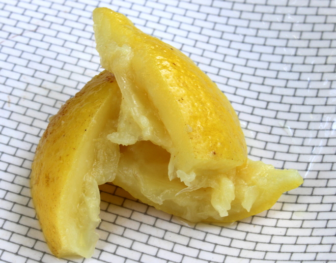
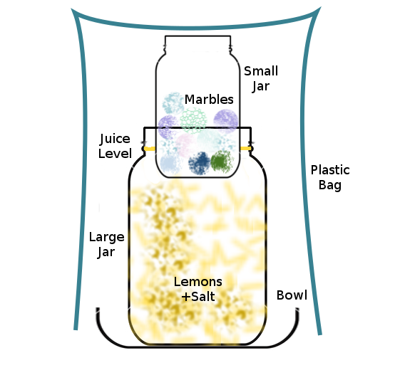

Title: Preserved Lemons
Date: 2017-01-13 22:00
Tags: make, food
Category: food
Author: elfnor

Without my own lemon tree, supermarket lemons are expensive so I go to the Farmers' market and get a large bag and make preserved lemons. When I first made these I didn't realize they were supposed to ferment and was a bit worried by the bubbling. When I use fresh lemons often I use only the juice or the thin outer rind. With the preserved lemons all of the lemon including the white part of the skin gets used. The lemons and juice are a little salty for sweet dishes but are awesome in stir-fries, stews, marinades, dressings, and kale salads.

## Preserved Lemons
_Makes 1 600 ml jar_

6-10 lemons  
2 t salt  

Find a ~600 ml glass jar with a wider mouth and another small glass jar that fits neatly inside the mouth of the large jar. Clean both jars inside and out. Find something to weigh down the small jar with. I use glass marbles.

Cut the lemons into quarters long ways. Most recipes say to only cut them part way through but they go into the jar better if cut all the way through. Pack into the large jar sprinkling in salt with each layer. Use a spoon or a large pestle to pack the lemons down squeezing out the juice. Continue until the jar is mostly full. The lemon juice should cover the lemon pieces.

Push the small jar into the large jar so that all the lemon pieces are held under the juice. The juice should come part way up the outside of the small jar. Add some weight to the small jar to keep it in place. All this minimizes the surface area exposed to the air and the potential for mould. Put the large jar into a bowl to contain any overflow and cover everything with a plastic bag to keep it all clean.

Leave to ferment in a warm place (20 &deg;C to 30 &deg;C) for about three weeks, the mixture should bubble after the first few days. Any overflow juice can be used in cooking. 

After 3 weeks the lemon skins should have changed texture and be softer and tastier. Put a lid on the large jar and store in the fridge. The lemons should keep for months. Stir occasionally to keep the lemon pieces under the salty juice.

-----------------------

Recipes that use this: (links added as I write them)

*  Chicken Liver Pate

Similar recipes: (links added as I write them)

*  [Fermented Marmalade]({filename}REC-fermented-marmalade.md)
