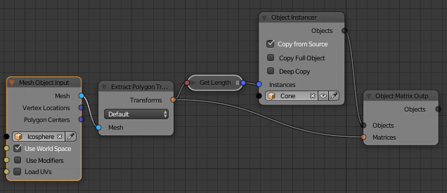

Title: Blender Animation Nodes
Date: 2018-06-30 22:00
Tags: make, think, blender
Category: think
Author: elfnor

The Blender add-on Animation Nodes has been around almost as long as the Sverchok add-on. Both started around 2013/14. I'm far more familiar with Sverchok and have contributed code to it. I thought I'd take a look at Animation Nodes (AN) and see how it differs and compares.

Both are node based tools for working with geometry in Blender. Sverchok is a bit more orientated to meshes (think edit mode) and AN more towards objects. But there's heaps of overlap. Both have between 200 and 300 nodes to play with.

Going by commits on github, Sverchok has more people making a significant contribution but AN has more watchers and stars. AN also has more of a presence on Blender stack exchange and on youtube.

Good places to learn more about AN include the [docs](https://animation-nodes-manual.readthedocs.io/en/latest/), these [text tutorials](https://squircleart.github.io/index.html), [locul guru's](http://www.local-guru.net/) short animations.

Here I'm just going to give a few quick node diagrams comparing how to do the same thing in Sverchok and Animation Nodes.

For future reference I'm using version 2.1.2

## Copy object to center of the polygons of another object

## Iterate Matrix

## 3D Fractals

## Random walk

## Euler's Theorem
to show how groups work

## Thoughts so far
*  In AN, I miss being able to save node diagrams as json.
*  I really like the looping subprogram mechanism in AN.
*  AN should be faster due to it being compiled in cython, but I haven't come up with a reasonable test of this.
*  Sverchok has many more nodes for generating objects or meshes (28 vs 5).
*  Animation nodes uses the materials from the objects in the display.
*  Sverchok uses multi-level lists of lists which means many nodes automatically are vectorized. Not all AN nodes are vectorized - need to use loops.
*  It easier to temporarily hide output in Sverchok
*  Sverchok source code is easier to read. This is probably just that I'm more familiar with the coding style.

Its not either AN or Sverchok, parts of a process can be done in one then moved to the other, as both node tools input and  output objects and meshes to the Blender interface.
