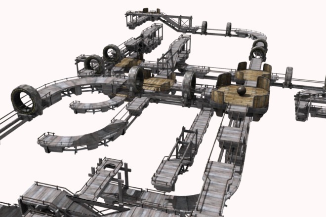
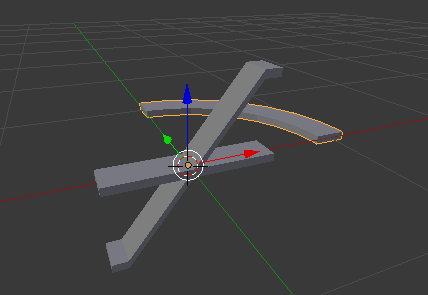
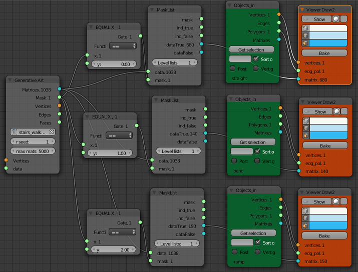
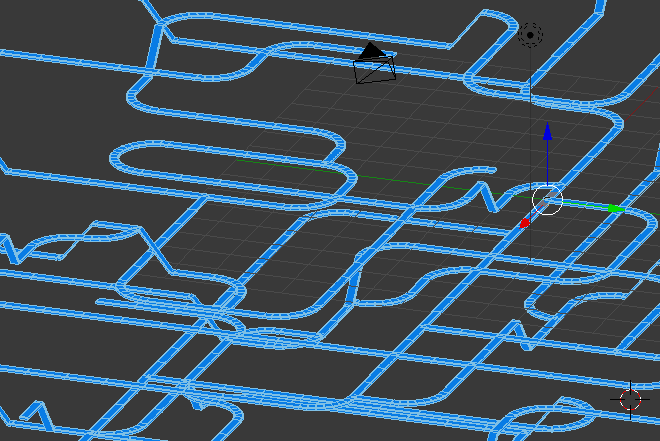
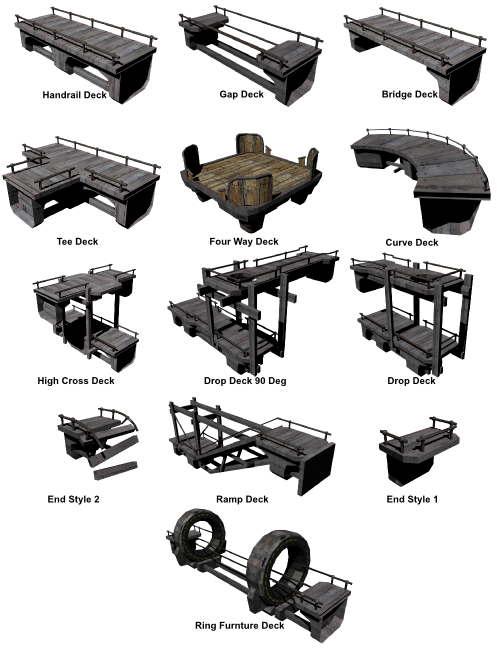
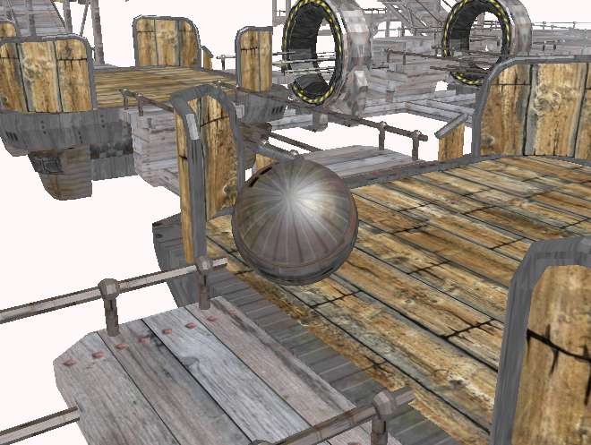

Title: Blender Game Level Generator
Date: 2015-06-11 22:00
Tags: make, think, blender, sverchok, structuresynth
Category: think
Author: elfnor



I was testing a puzzle level for my partner Tech Monkey's [__Steely Taws__ Blender game](http://www.techmonkeybusiness.com/steely-taws-puzzle-game-v1.html) and the components started to look a bit like things produced by my [Blender Pipe Generator]({filename}blender_pipe_generator.md). 

__Steely Taws - No Quitsies__ is a marble run game based on Switchball and Balance. At its most basic it requires straights, bends and ramps. It was not too hard to put together an automatic level generator using the "Generative Art" node of the [Sverchok](https://github.com/nortikin/sverchok) Blender add-on. If you're new to Sverchok maybe back up and read my Simple Sverchok series ([part 1]({filename}simple_sverchok_01.md)) and the [documentation for the node](https://github.com/nortikin/sverchok/blob/master/docs/nodes/generator/generative_art.rst).

I'll start with a simple example that just has very basic components, then I'll show you how we standardized the Steely Taws game components to work with the "Generative Art" node. Then I'll finish up with the blend file with the components, Sverchok node diagram, xml description to build the level and the game logic to allow anyone to generate and play an unlimited number of random Steely Taws game levels. The same concept could be used to produce random levels for games with quite different architectures, for example a dungeon game with corridors and stairs.

For a demo version to prove this would work I made a simple straight, bend and ramp. The straight section needs to go from (-0.5, 0, 0) to (0.5, 0, 0). The bend goes from (1, 0, 0) to (0, 1, 0) and has its origin at (0, 0, 0). This is the same as the [Blender Pipe Generator]({filename}blender_pipe_generator.md) but in this case the components are flat rather than round. The ramp goes up from (-0.5, 0.5, 0) to (0.5, 0.5, 0).



The xml that describes the design is very similar to that used for the Pipe Generator. It defines 6 versions of the "R1" rule. The Generative Art node chooses versions of these rules at random. The first version places the straight section, the next two place left and right bends rotating the bend object as required. The next two place the ramp object to go up or down and the last version creates an intersection. The names for the shapes have been prefixed with "00", "01", "02" so they  sort in a predictable way to make it easy to assign the correct object to the correct shape in the Sverchok node diagram. 

```xml
<rules max_depth="50">
    <rule name="entry">
        <call count="4" transforms="rz 90" rule="R1"/>
    </rule>
    <rule name="R1" weight="100" dir="straight">
        <instance transforms="tx 0.5" shape="00_straight"/>
        <call transforms="tx 0.5" rule="R1"/>
    </rule>
    
    <rule name="R1" weight="10" dir="left">
        <instance transforms="ty -1" shape="01_bend"/>
        <call transforms="tx 1 rz -90" rule="R1"/>
    </rule>
    
    <rule name="R1" weight="10" dir="right">
        <instance transforms="rz -90 tx -1" shape="01_bend"/>
        <call transforms="ty 1 rz 180" rule="R1"/>
    </rule>
    
    <rule name="R1" weight="10" dir="up">
        <instance transforms="tx 0.5 tz 0.5" shape="02_ramp"/>
        <call transforms="tx 0.5 tz 0.5" rule="R1"/>
    </rule>
    
    <rule name="R1" weight="10" dir="down">
        <instance transforms="tx 0.5 tz -0.5 rz 180" shape="02_ramp"/>
        <call transforms="rz 180 tx 0.5 tz -0.5" rule="R1"/>
    </rule>
    
    <rule name="R1" weight="10" dir="branch">
        <call rule="R1"/>
        <call transforms="rz 90" rule="R1"/>
    </rule>
            
</rules>

```

The Sverchok node diagram is a bit more complicated than for the Pipe Generator as we now have three different types of objects (straights, bends and ramps) to place. The easiest way to do this is to use a "Logic" node before the "Mask" node.





The "Generative Art" node processes the xml file to randomly add the different types of objects. The weights given with each version of the rule determine the frequency of each type of component. Increase the weight of the "left" and "right" version of the rules and the design will have many more bends. Changing the "rseed" value in the "Generative Art" node generates a different set of random numbers and will produce a different level design.

The processor dosen't know anything about where it previously placed objects so there will be random intersections of paths. With simple objects these intersections look the same as branches and just add to the complexity of the design.  With the objects used in the Steely Taws game the rails placed on the sides of the path make these intersections tricky to play. Manual editing is required to tidy these intersections up deleting rails where needed. 

Seeing the demo worked well my partner set to work standardizing the Steely Taws components so they fitted on a regular grid. The demo above is based on a grid of 1 Blender unit, the game components have a standard size of 12 units long, x 4.25 units wide, and 3 units deep.



The drop deck components are interesting as they make some paths one way only. This means the player can get stuck with no way back. Either follow up the auto level generation with some hand editing to make the game level playable or only use ramps (set the weight of the drops to zero). The ramps can be driven both up and down. To keep the level from always dropping or climbing make the sum of the weights of down components (drops and down ramps) equal to the weight of the up ramps.

In the blend file I've used "mesh instancer" nodes to the replace the "Objects In" and "Viewer Draw" nodes. This allows the same mesh to be used for every straight in a similar way to when you do  a linked duplicate in Blender and produces a much smaller file.

Here are some screen shots of the game being played in the Blender Game Engine.




The blend file available [here](/downloads/steely_taws_level_gen.blend) contains each of the components on a separate layer. The game itself should be generated on the 1st layer.

Install a recent version of [Sverchok](https://github.com/nortikin/sverchok) then open the blend file. A simple level with 50 components should be automatically generated. Maximise the 3D View (CTRL-UP). Select the  camera view (NUMPAD-0) then press P to start the game. Controls are provided for either the arrow keys or a joystick. If you fall off the edge you will automatically respawn at the start.

To make your own levels, press ESC to close the game and return to Blender. 

The easiest way to get a new level is to change the the "rseed" value in the "Generative Art" node. The levels are random and all parts of the level may not be reachable due to intersecting paths. Also some parts of the levels may be dead ends due to the drops being one-way. Edit the level by deleting or moving components. Most of the handrails are separate objects so they be easily deleted at intersections. Delete lots more rails to make a level more difficult.

Another way to change a level is to change the weights for each rule in the xml text block (steely_taws.xml). The larger a weight the more often that component will appear in the level. 

Setting the weight of a rule to zero will mean that component will not appear at all. This may require some changes to the numbers in the "Logic" equal nodes to make the correct mask output connect to the correct object. Each integer in the "Mask" output of the "Generative Art" node corresponds to one of the shapes use in the xml. The integers are assigned to the shapes in alphabetical order. So if one shape disappears from the output the ones further down in the order will move down one integer. The "drops" have been given the last places in the shapes list so they can have their weights set to zero without affecting the other shapes. 

Go across to Tech Monkey and get the full [puzzle version](http://www.techmonkeybusiness.com/steely-taws-puzzle-game-v1.html) to add more puzzle features such as switches, movable boxes,barriers, gates, elevators and draw bridges. The components are all described in detail [here](http://www.techmonkeybusiness.com/steely-taws-components.html).

----------------------------------------------------------------------


