Title: Scripted Shaders in Blender - Packing Spheres
Date: 2018-10-26 22:00
Tags: make, think, blender
Category: think
Author: elfnor
Status: published

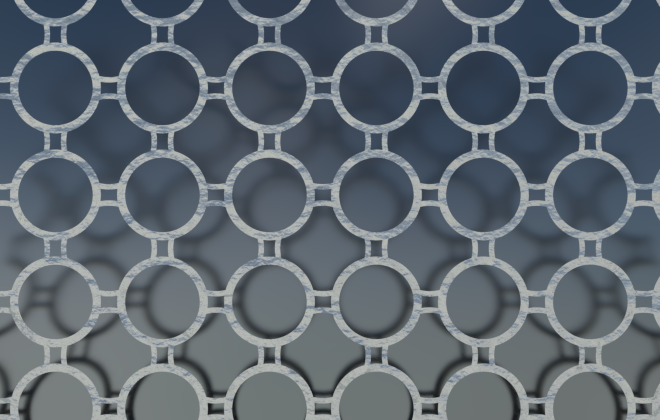

I've started learning how to write Cycles [script nodes]() for Blender. These are written in Open Shading Language. A couple of good places to start are Michael Anders [blog](https://blog.michelanders.nl/search/label/osl) and [book](https://blendermarket.com/products/open-shading-language-for-blender), the [language specification](https://github.com/imageworks/OpenShadingLanguage/blob/master/src/doc/osl-languagespec.pdf) and the last part of Jeremy Behreandt's [article](https://medium.com/@behreajj/creative-coding-in-blender-a-primer-53e79ff71e).

Here are my first experiments with a shader based on packing spheres onto cubic grid. The layering of shaders onto each other is inspired by a [Blender Suhsi ](https://blendersushi.blogspot.com/2013/08/osl-disk-grid.html) post.

Shaders make you think about pattern quite differently than when using a drawing package. The shader (as they're used here to create a procedural texture) take a pixel position on an object and decides what color to paint it. The shader is going to be called at least once per pixel and needs to be reasonably efficient, as the OSL script nodes in Blender are calculated on the CPU.

The shader function only knows about its inputs (and some global variables). It has no information, for example, about the color of neighboring pixels.

To draw spheres we need to decide whether the current pixel is inside or outside the desired spheres.

This first shader draws a single sphere. It calculates the distance from the *Vector* input point to the origin. It then creates a step function where the distance equals the radius and assigns the colors accordingly.

```C
shader sphere(
    vector Vector = P,    
    float Radius = 0.5,
    vector Offset = 0,
    color ColorA = 1,
    color ColorB = 0,

    output color Color = 1,
    output float Fac = 0,
){
  float d = distance(Vector + Offset, vector(0, 0, 0));
  float inDisk = step(Radius, d);
  Color  = mix(ColorA, ColorB, inDisk);
  Fac = d;
}
```

The input vector is assigned to *P* if no input is connected to this socket. *P* is a global variable that gives the world coordinates of the pixel being colored. If we move the object away from the origin, the texture will stay at the origin fixed in world space.

The above shader describes a sphere at the origin. In the image below, the circles on each face vary in radius, depending on where the face intersects the texture sphere at the origin. Notice how the texture also intersects the cube on the right just a little.

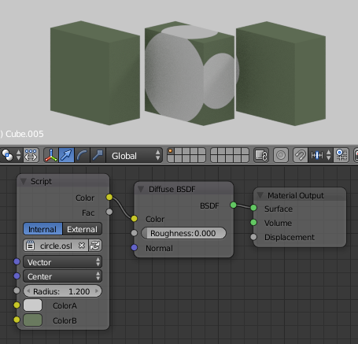
*A series of cubes (Dimensions = (1.0, 2.0, 2.0))   
with the circle shader applied in world coordinates.   
The texture radius has been increased to 1.2*

We can connect different texture coordinates to the *Vector* input to map the texture to the object in different ways. The most useful are *Generated*, *UV* and *Object*.

The *Generated* coordinates range from 0 to 1 on the three axes of the object bounding box. This is the default for the built in Cycles texture nodes. Each sphere starts at (0, 0, 0) of bounding box and extends halfway (Radius=0.5) along the box edge.

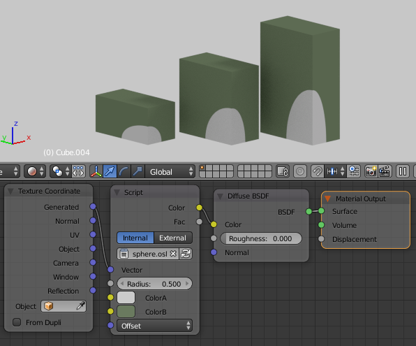
*Generated coordinates on cubes*

*UV* needs a UV map assigned to the object and works as usual. Here is a torus with the default *Unwrap* map applied. The *Offset* x-value was set to -0.5 to move the texture relative to the quads on the torus.

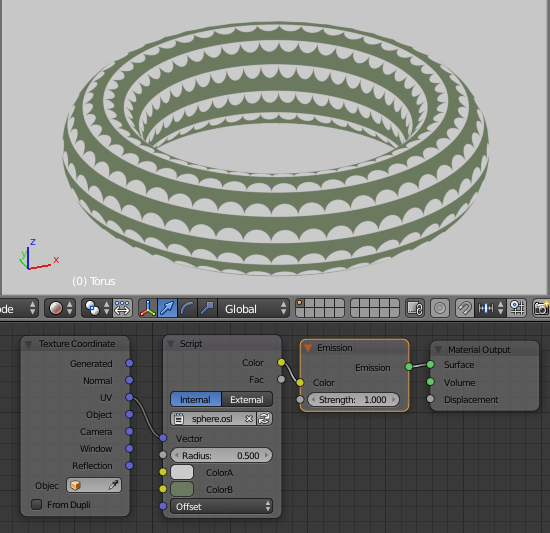
*Default UV map on torus*

The *Object* coordinates are centered on the object center and are not scaled by the object's bounding box. The texture now moves with the object and is scaled by the *Scale* values of the object. Below, the left and middle cubes have *Scale* = (0.5, 1.0, 1.0), *Dimensions* = (1.0, 2.0, 2.0). The circle pattern appears elliptical on the side faces because the texture is applied before the scale. The cube on the right has the scale applied (*Scale* = (1.0, 1.0, 1.0), *Dimensions* = (1.0, 2.0, 2.0)). Its pattern stays circular on all faces.

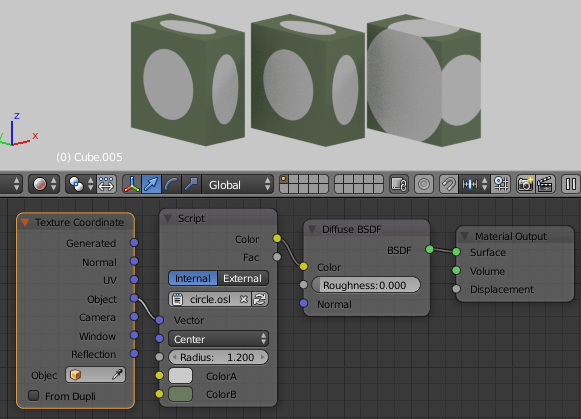
*In object coordinates the texture is centered on each object and is affected by the scale of the object*

To draw an array of spheres we don't want to calculate the distance to every center point in the array and then decide which center point is the closest. This would be really inefficient. Instead we map each input point to a single unit of our pattern, and then do a minimum number of distance calculations.

For a cubic array this is fairly simple. We use the *mod* function to map every point into a single cube centered at the origin. For this shader I've added *Blur*, and *Scale* inputs. Increasing the scale puts more repeats of the pattern. The scale is a single value to match the built-in Cycles texture nodes. To scale different amounts in different directions use a *Mapping* node on the *Vector* input. The *Blur* input is used in the *smoothstep* function.

```C
shader sphere_pack_cubic(  
    vector Vector = P,
    float Blur = 0.0,
    float Radius = 0.5,
    color ColorA = color(1,0,0),
    color ColorB = color(0,1,0),
    float Scale = 1.0,
    vector Offset = 0,

    output color Color = 0,  
    output float Fac = 0,
)  
{  
    vector svec = Scale * Vector + Offset;

    float sx = mod(svec[0] - 1, 2) - 1;  
    float sy = mod(svec[1] - 1, 2) - 1;   
    float sz = mod(svec[2] - 1, 2) - 1;  

    float d = distance(vector(sx, sy, sz),vector(0, 0, 0));  

    // step from Color A to ColorB at this distance
    float inDisk = 1 - smoothstep(Radius - Blur, Radius + Blur, d);
    Color  = mix(ColorA, ColorB, inDisk);
    Fac = d;  
}
```

An easy way to confirm the shader is correct is to plug it into a volume shader.


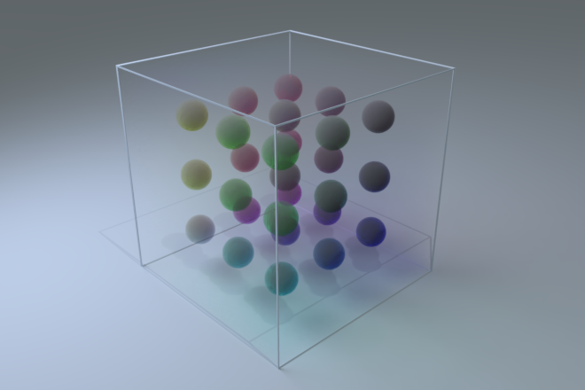
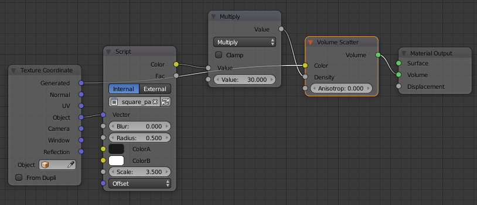
*Using the shader for a volume shader*

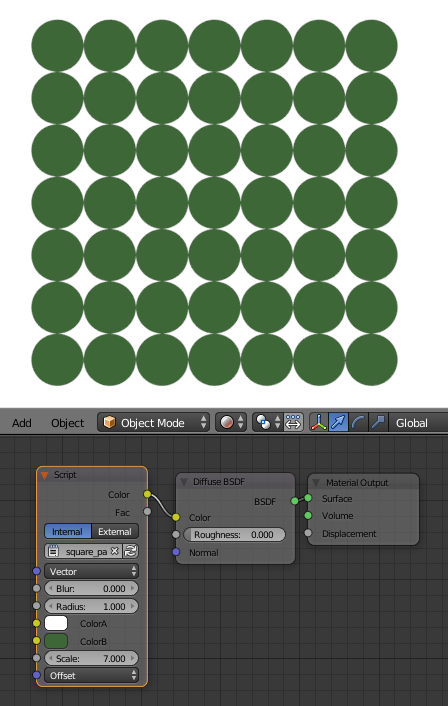
*Using the shader on a plane*

This fairly simple shader can be used to do some interesting things.

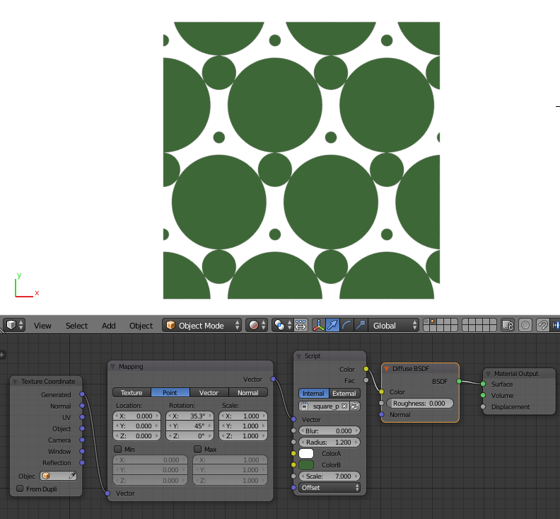
*altering the mapping coordinates*

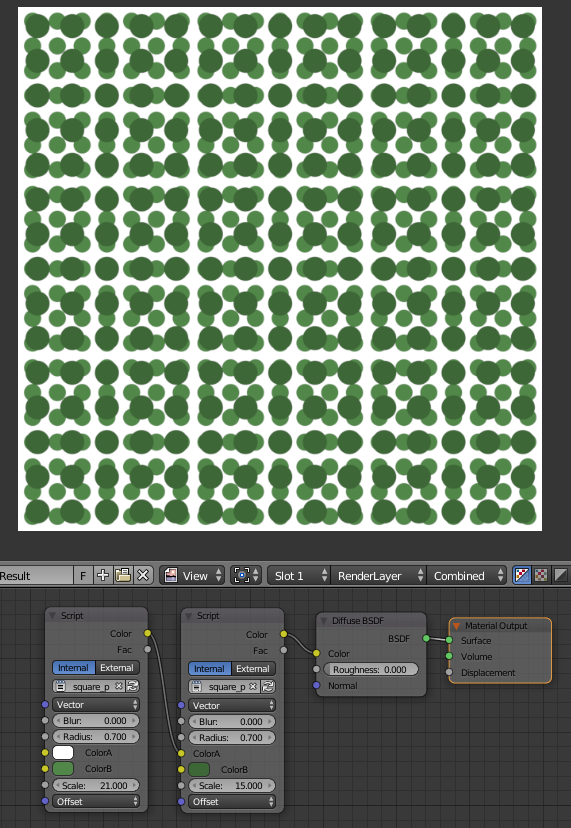
*overlapping copies at different scales*

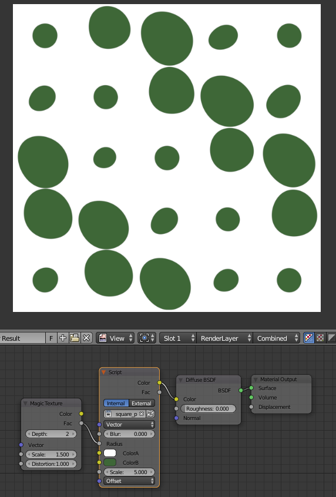
*add a random texture to the radius*

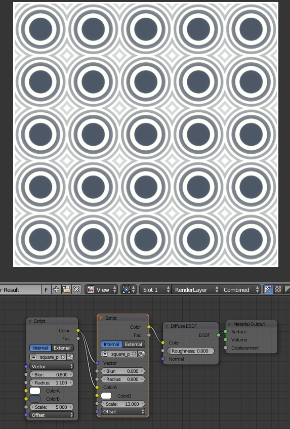
*Starting to play*

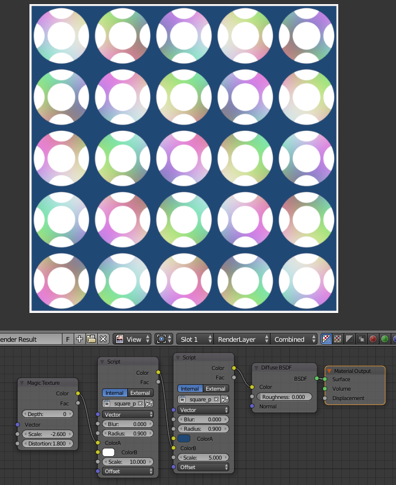
*more overlapping copies*
