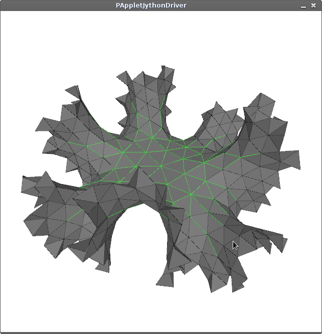
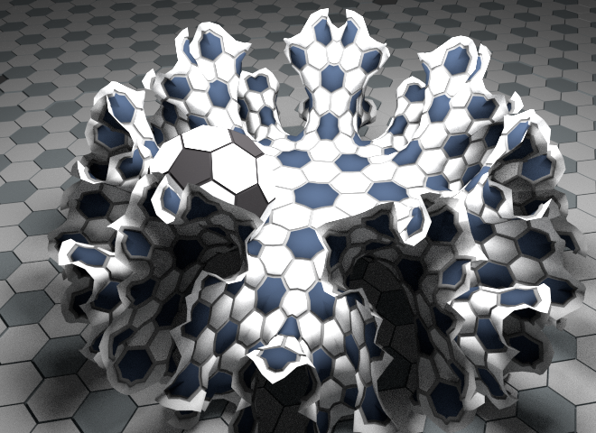

Title: Larger Hyperbolic Tilings in 3D using Processing
Date: 2015-11-27 22:00
Tags: make, think, blender, processing
Category: think
Author: elfnor


After my [last post]({filename}hyperbolic_tilings.md) on producing tiled hyperbolic planes in 3D, I was still unhappy with the size of the planes I could generate. Using the soft body modifier in Blender I was limited to about 250 faces before everything went unstable. Also after the tiling has been unfurled the length edges were still longer in the middle and shorter towards the edges where they should all be equal. (OK, I'm getting a bit obsessed with this)

The physics needed to unfurl the tiling into 3D space is a mass spring network where each vertex of the mesh is a mass and each edge of the mesh is modeled as a spring with a fixed rest length. The rest length needs to be able to be set to be different from the initial edge length. To avoid the mesh intersecting itself each vertex of the mesh also needs to repel all other vertices. 

I can't see any way to set rest lengths directly in either the soft body modifier or the cloth modifier in Blender so I went back to the [Traer Physics](http://murderandcreate.com/physics/) library available for Processing. I recently discovered that Processing has a "python mode" that allows python code to be written in the Processing environment. This allowed me to directly combine the ```hyperbolic_tiling.py``` code written for Sverchok with the Traer physics library.

The Processing sketch available in the [Hyperbolic Coral](https://github.com/elfnor/hyperbolic_coral) repository on github outputs ```obj``` files that can easily be imported into Blender. I've included a number of these files in the repository in case anyone wants to play with them without installing Processing. 

If you do want to run the sketch you'll need to [install Processing](https://processing.org/). Then from with in the Processing environment ```Tools > Add Tool... > Modes``` install the python mode. From the libraries tab install the ```PeasyCam``` camera library. The [Traer Physics library](http://murderandcreate.com/physics/) needs to be downloaded, unzipped and copied to give this folder structure ```~/sketchbook/libraries/physics/library/physics.jar```.

Download a copy of the [Hyperbolic Coral](https://github.com/elfnor/hyperbolic_coral) files from github and unzip them somewhere.  Run Processing and change the mode to Python. Open the file ```hyperbolic_tiling.pyde``` and create a new folder when prompted. Move a copy of ```hyperbolic_tiling.py``` into the same folder. Run the script and you should see a window displaying the tiling unfolding. 



There's no fancy interface for this. Edit the ```p, q, layers``` parameters in the ```setup()``` function and re run. The tilings are described with two numbers, ```p``` the number of sides to the polygons used and ```q``` the number of polygons that meet at each vertex. The number of ```layers``` describes how many rings of polygons to include. Each polygon face is divided into triangles and the polygons are not so obvious in the mesh.

As the number of layers increases the number of faces in the mesh increases exponentially and the simulation slows down but still runs. I've successfully produced meshes with 1624 faces. 

As the unfurling occurs the edges are colored in according to their length. Red edges are shorter and green edges longer than the set rest length. The cutoff values are given by ```d_long``` and ```d_short``` in the ```draw()``` function. When the edges fall between the values they are drawn in black. The tiling lengths are still not perfectly even but they're better than I was getting in Blender.

When the physics simulation has settled down the ```w``` key can be used to write the mesh to an ```obj``` file (```ht_01.obj```). These files are really simple just lists of vertices and faces but they can be successfully imported into Blender.

The ```e``` key can be used to print some statistics about the edge lengths to the Processing console. This is useful when fine tunning the physics parameters. 

```
# physics spring system  
# system parameters
mass = 1.1 # mass of particles
restlength = 1.0  # Rest length of springs between nodes
strength = 0.99    # Strength of springs between nodes
damping = 0.02   # Damping of springs between nodes
drag = 0.9  # Physics System drag (friction) 
repulsion = -0.01  # Repulsion force between nodes
repulsion_mindist = 0.5  # Distance from node where repulsion force begins to decrease
```

I've spent some (way too much) time adjusting these parameters to give as even an edge length as possible while still avoiding mesh intersections and aiming for a symmetrical final mesh. Paul Bourke's  [description](http://paulbourke.net/miscellaneous/particle/) of the maths and physics of this type of particle system  was a help here (he also provides an implementation in C). 

My best advise if playing with this is lower the drag and increase the negative repulsion force if the mesh has intersecting faces. If the simulation goes unstable reverse the changes incrementally. You normally end up trading longer edges in the center for no intersections toward the edge. 


Here to follow up on the previous posts is the hyperbolic football with friends.



------------------------------------------------------------------------------------

