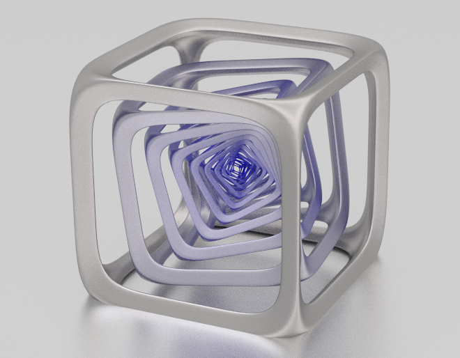
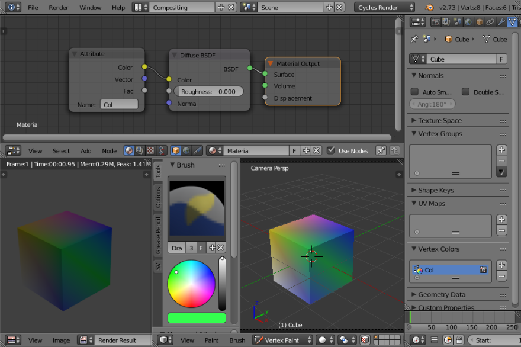
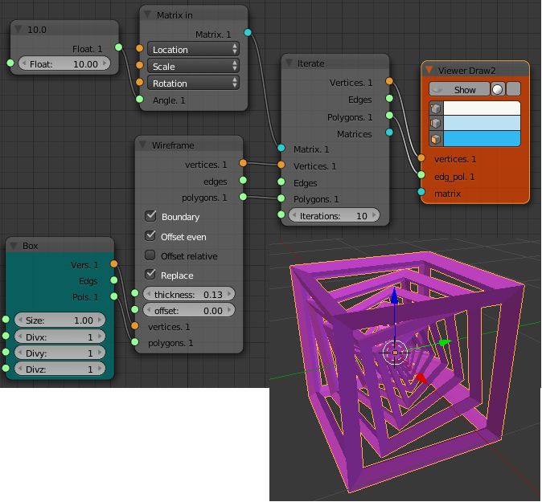
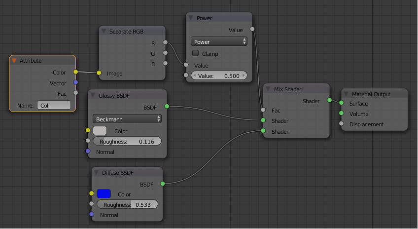

Title: Shaders for Sverchok 02 - Vertex Colors
Date: 2015-02-26 22:00
Tags: make, think, blender, sverchok
Category: think
Author: elfnor



This is the second of my Shaders for Sverchok tutorials. They follow on from  my [Simple Sverchok](http://elfnor.com/tag/sverchok.html) series. The Shaders for Sverchok posts are mostly about Blender Cycles Materials and how I apply them to my [Sverchok](http://nikitron.cc.ua/sverchok_en.html) models rather than directly about Sverchok nodes.

This post will show how to apply vertex colors to a mesh with Blender python and then how to access the vertex color map to apply color or other variation to a material in Blender cycles.

From this [sneak preview](http://blenderartists.org/forum/showthread.php?272679-Addon-WIP-Sverchok-parametric-nodes-for-architects&p=2813513&viewfull=1#post2813513) it looks like Vertex Colors may be avaliable soon as Sverchok node, but currently I use a short bit of code to cover this step. I'll update this post when the node becomes available in a general release.

Using vertex colors is easiest if the Sverchok output is a single mesh. If after baking your Sverchok output you have multiple meshes try the "Apply matrix to mesh" node or occasionally the "Mesh Join" node to consolidate everything into one mesh. It is also possible to select the objects after creation and join them with CTRL-J. I prefer using the "Apply Matrix" node as this preserves the creation order of the mesh elements. 

Vertex colors are normally applied by painting them on in "Vertex Paint" mode. To get them to show as painted in Blender cycles use a material as shown below. The "Attribute" node is found on the "Input" panel of the cycles nodes. The "Name" has to be set to the same as the name of the "Vertex Colors" layer found under the Objects Data panel.



Rather than paint on our colors we're going to assign them to the vertices using Blender python. Each vertex in each face has its own vertex color. This means a vertex can have several different colors, one for each face it's on. The following code snippet gives a different vertex color for each sub-element of a mesh. Say for instance we've used a "Matrix Iterate" node to make 11 copies of a Box (10 iterations produces 11 copies). Then the code snippet will make all the vertices in each box the same color but each box will have a different color.



```python
"""
set vertex color to shades of grey, each cube in sverchok structure has its own shade
"""
import bpy
import random

# start in object mode with object selected
#need to set N to the number of sub-elements in mesh
N = 11 # no of elements

obj = bpy.context.active_object
mesh = obj.data

if not mesh.vertex_colors:
    mesh.vertex_colors.new()

color_layer = mesh.vertex_colors.active

nvert = len(color_layer.data)/N
inc = 1.0/N
i = 0
for poly in mesh.polygons:
    for idx in poly.loop_indices:
        rgb = [(i//nvert)*inc, (i//nvert)*inc, (i//nvert)*inc]
        color_layer.data[i].color = rgb
        i += 1
``` 

Before running the above code you need to set N in line 9 of the code to the number of sub-elements in the mesh. The code sets each sub-element to a shade of grey. You can fiddle with the code to produce different vertex colors, but I prefer to manipulate the color later with cycles nodes as this give me more flexibility.

After running the code check in the Objects data panel to find the name of the vertex color layer. By default its "Col". Use this in a attribute node to access the values for the vertex color. This color can then be separated out into rgb components and used to vary the material properties across the sub-elements in the mesh. In the node diagram below it's used to control the "fac" of a "Mix Shader" to mix between two materials.


--------------------------------------------


