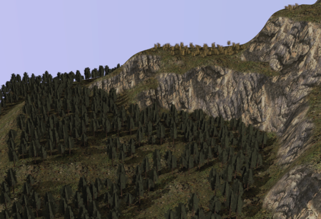
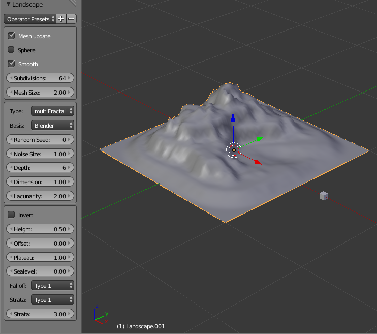
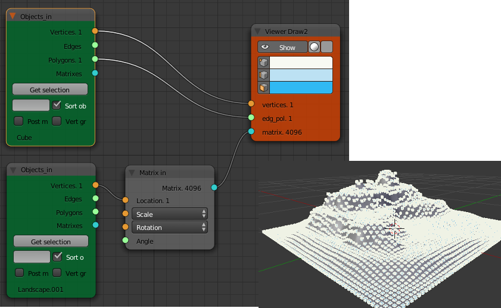
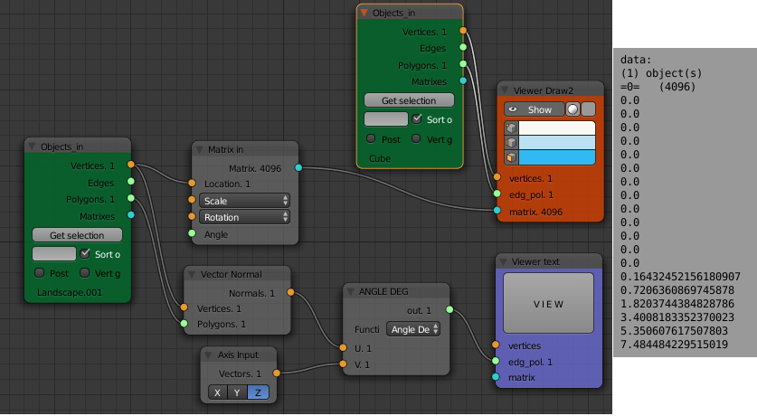
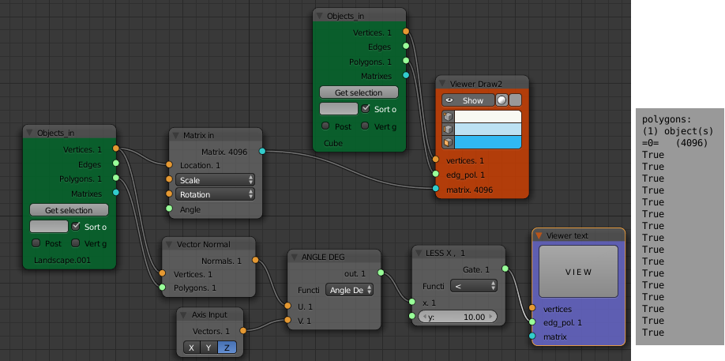
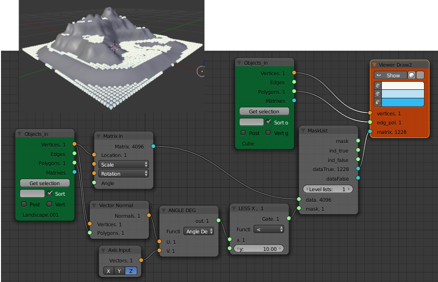
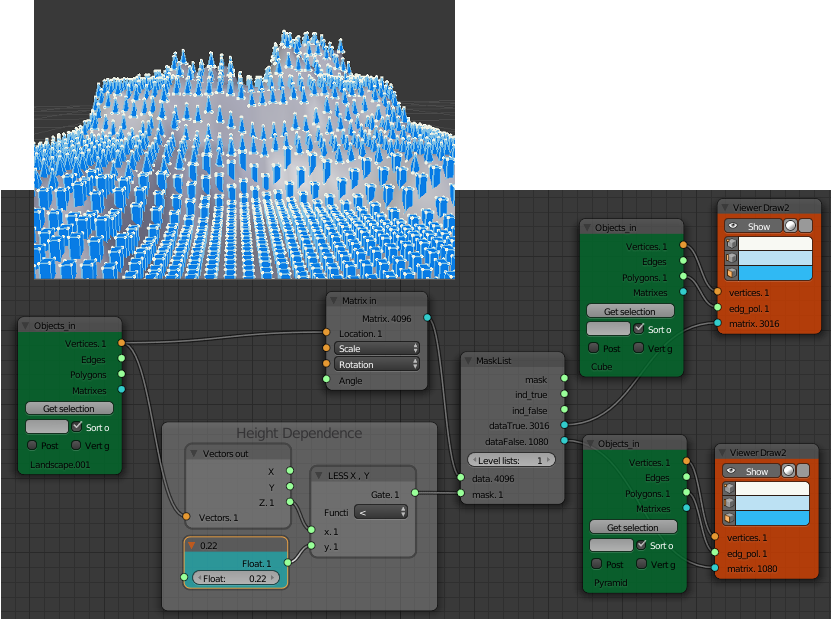
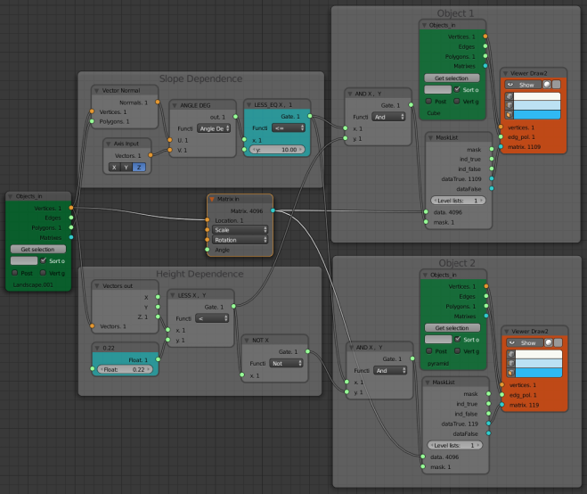
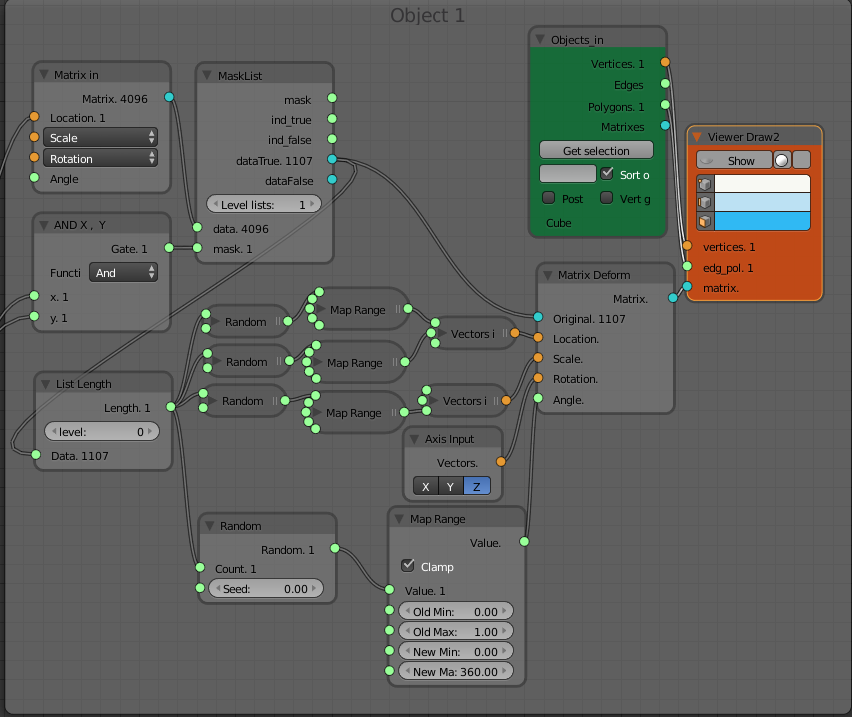
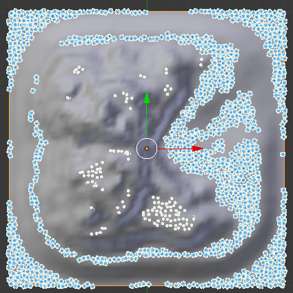

Title: Simple Sverchok 03 - Slope Dependent Trees
Date: 2014-12-30 22:00
Tags: make, think, blender, sverchok
Category: think
Author: elfnor

The first two posts ([01]({filename}/simple_sverchok_01.md), [02]({filename}/simple_sverchok_02.md) ) in this gentle introduction to Sverchok covered copying objects to the centers of polygons and scaling the copied objects according to some pattern. 

In this post we'll look at applying what we've learnt to planting trees across a landscape. We'll make the trees only grow on reasonably flat land and make different types of trees grow at different heights.

First off activate the Ant Landscape add-on available under user preferences. (It should be included in the default install). Use Add > Mesh > Landscape to generate a mesh. Fiddle with the landscape parameters in the tool panel until the landscape looks good. Add some flat spots using the Strata drop down near the bottom of the tool panel. These will be where we'll plant the trees.

We could copy the trees to the centers of the polygons of our mesh similar to the previous two posts but to try something new this time we'll copy them onto the vertices of the mesh instead.

To copy an object on to every vertex just requires this simple node diagram. All the copied objects z vectors point in the same direction as the original object, as we've only provided information about location and none about rotation.

Slope Dependence
---------------

To determine the slope at any point on the landscape we use the "Vertex Normals" node found under "Analyzers". This node outputs a list of vectors, one for each vertex. The angle between the vertex normal and the z-axis will give us a value for the slope that is zero degrees for flat land and 90 degrees for vertical cliffs. To calculate this angle use the "Vector Math" node from the "Vector" group and set its function to "Angle degrees". Use the "Vector X|Y|Z" node as the other input. Check with the "Viewer text" node that this gives a list of angles for each vertex of the landscape.

Next we want to select some of these vertices depending on this slope value. Add a "Logic" node and set its function to "<" (less than).  Set a suitable value (say 10) for the second input. This will output  a list of True or False values (booleans)  for each vertex of the landscape depending on its slope. 

The "Mask List" node takes a list of booleans (mask) and a data list and separates the data into two lists one for when the matching values in the mask are True and one for when they are False. 

The landscape should now have little cubes only on the flat spots. Changing the value in the "LESS X" logic node will change the maximum slope on which cubes are placed. 

Height Dependence
--------------

To keep things simple I'll explain the construction of a node diagram for different types of trees at different heights separately then combine the two node diagrams at the end. 

Add a different low polygon object to the scene. I'd suggest a cube with the top four vertices merged at the center. For speed, I tend to use low polygon meshes at this early stage, later I will bake the Sverchok results using the same low polygon copies as placeholders. Then I link the data and materials of the desired real object to the copies produced by Sverchok.

The node diagram for height dependence is roughly similar to that for slope dependence. The z-component of the vertex position is compared to a float value with a logic node. This list of booleans is fed to a "Mask List" node which separates the matrices for transforming an object to the vertex position into two lists. The "dataTrue" list is fed to the matrix input of one "Viewer Draw" node, the "dataFalse" list is fed to a different "Viewer Draw" node. Each "Viewer Draw" node gets its vertices and polygons from a different "Object In" node. The low elevation vertices ("dataTrue") are connected to the cube and the high elevation vertices ("dataFalse") are connected to  the pyramid.

The node diagram including both slope and height dependence is shown here. (Click for a larger view). 

Unless its a plantation forest, our trees will look better with some variation in the x and y locations,  z-scale and rotation about the z-axis. This is done with a number of "Random" nodes similar to how we randomized the z-scale of the objects in the last post. This node diagram gets very messy so I've colapsed all the nodes except those for randomizing the rotation about the z-axis. You can examine the full diagram after downloading the blend file. The "Map Range" node is used to map the [0, 1] range of the output of the "Random" node to the needed range of [0, 360] for the angle input of the "Matrix Deform" node.

An aerial view of the landscape showing the random location and rotation of the objects.

Download [blend file](/downloads/slope_greeble.blend)

Note: Credit and thanks to [TechMonkey](http://www.techmonkeybusiness.com/) for the textures and tree models used in the image at the top of the post. The slope dependent texturing in that image was done following [this tutorial](http://vimeo.com/28922937) by David Miller.

___________________________

