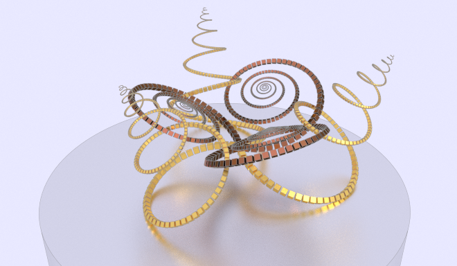
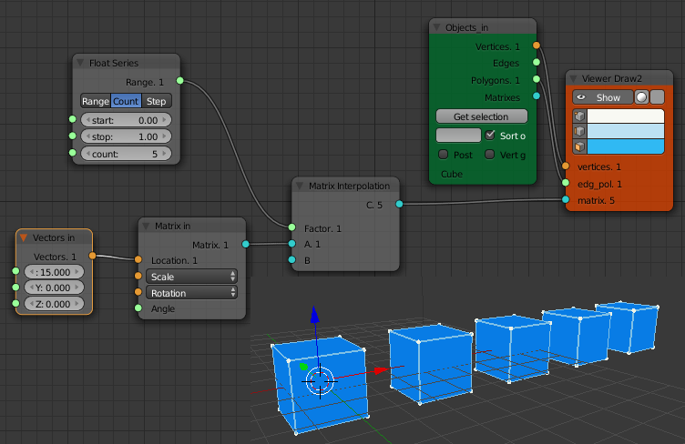
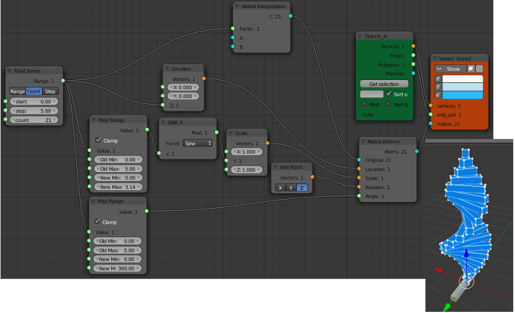
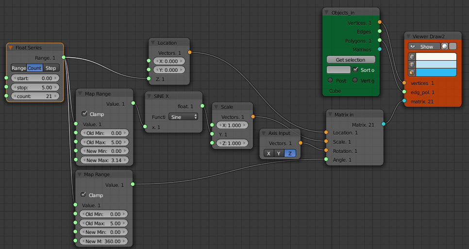
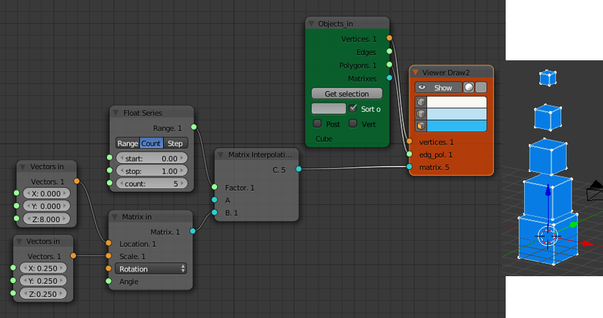
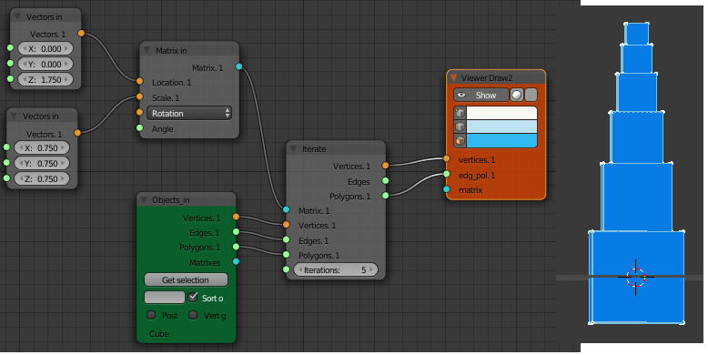
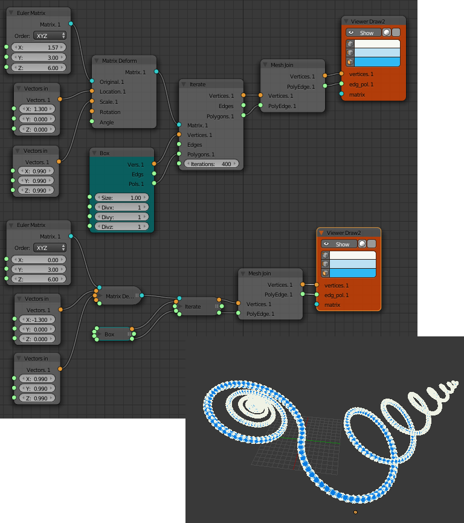

Title: Simple Sverchok 05 - Interpolate and Iterate Matrix
Date: 2015-01-31 22:00
Tags: make, think, blender, sverchok
Category: think
Author: elfnor

This is part five of my introduction to [Sverchok](http://nikitron.cc.ua/sverchok_en.html) the parametric node geometry add-on for Blender. Other parts can be found [here](http://elfnor.com/tag/sverchok.html)

So far we've used various nodes to produce list of matrices that we've used to give the location, scale and rotation of objects. This post continues that idea.

The "Matrix Interpolation" node takes one or two matrices as input and produces a list of matrices that describe transformations interpolated between the two matrices. If only one matrix is input the identity matrix (no transform) is used for the other matrix. This is great for example to make a whole line of objects.

The input matrix could also include a scale and rotation.

The "Matrix Interpolation" node can also be used to produce a list of identity matrices that are then altered by a "Matrix Deform" node. This allows non-linear variation in the object scales and rotations as shown in the example below. Here we've produced 21 identity matrices. The "Map Range" Node is used to change the values from the "Float Series" from 0 to 5 (used for the locations) to 0 to 360 (used for the angle of rotation about the Z axis). The same range is also mapped to the interval 0 to pi. The sine of this function is then used to scale the objects in the y direction.

EDIT: We don't really need to use a "Matrix Interpolation" node in the above example. We can replace the "Matrix Deform" node with a "Matrix In" node as shown below and acheive the same result.

If we want to scale and shift the objects in the same direction, for example produce a stack of diminishing sized cubes sitting on top of each other, we can't do it with linear interpolation. In the image below the gaps between each cube centre are the same size. If the cubes are to sit on top of each other the gap has to decrease along with the cube size. 

If we scale the 1st cube (size 2 units) by 0.75 to get our 2nd cube (size 1.5 units) we then need to move the 2nd cube 1.75 units to stack it on top of the 1st cube. What we need to do here is apply a transform matrix M that does a 0.75 scale and a 1.75 unit translation to the 1st object to get our second object.

V2 = M * V1

Then we apply the same transform again to V2 to get V3

V3 = M * V2

and so on. This will stack the cubes nicely on top of each other. Since version 0.5.1.0 Sverchok has a "Iterate Matrix Transform" node that does this repeated matrix transform. Its currently in the Beta node panel.

Adding rotations to the matrix used as input to the iterate node will quickly produce some interesting structures. Below is the node diagram for the structure in the image at the top of this post. The same structure is used as the default start up script for the [Structure Synth](http://structuresynth.sourceforge.net/) application. Many of the other examples provided with Structure Synth could be used as starting points for exploration with Sverchok.

----------------------

